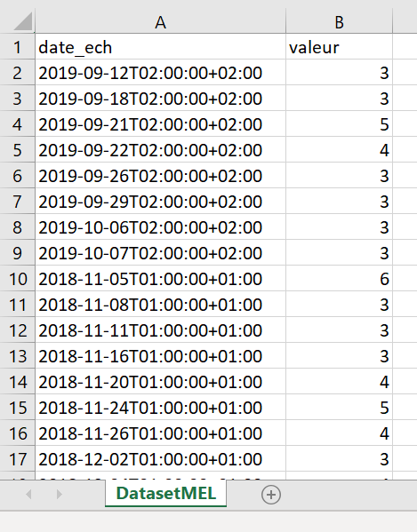
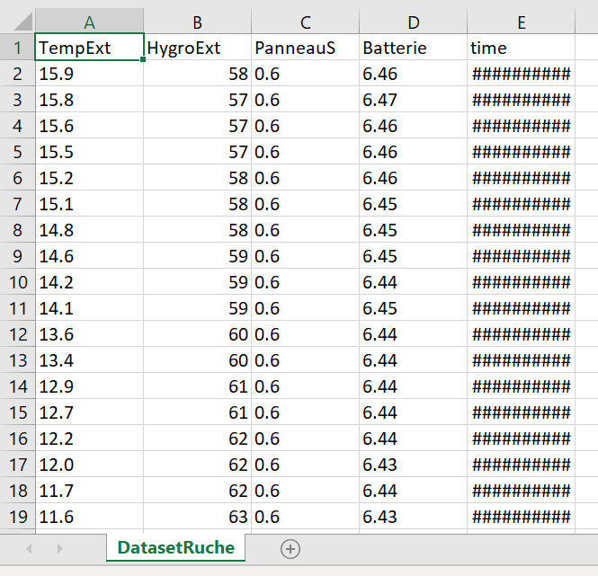

# ExtractingData

### Originals datasets

Here are the different CSV files we can download online:

- RecuperationDonnees.csv (content: Humidity, temperature... collected on the roof of the school)

- indice-qualite-de-lair.csv (content: Air index quality):

  https://opendata.lillemetropole.fr/explore/dataset/indice-qualite-de-lair/download/?format=csv&timezone=Europe/Berlin&use_labels_for_header=true

### Our datasets

Our script requestAPI_MEL.py directly download the dataset from the MEL's website and select what we need:

- DatasetMEL.csv : with only the air quality index for each day

  

Our script CreateDatasetBeeHive.py take the "RecuperationDonnees.csv" as an input and output the following dataset:

- DatasetRuche.csv : contains the temperature, humidity, sun exposure, the level of the battery (may be releavant to take into account the sun exposure) and the timestamp

  