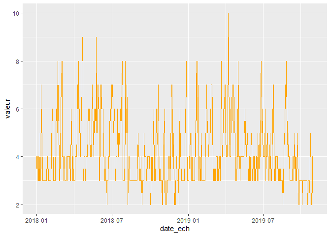
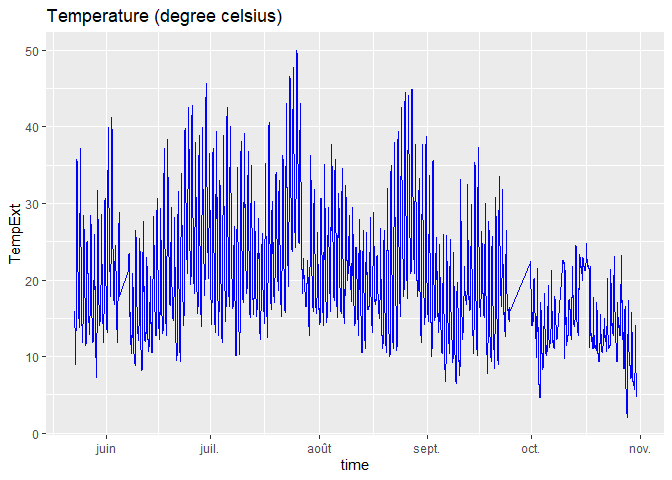
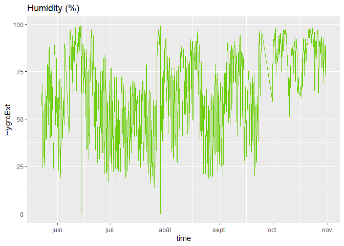
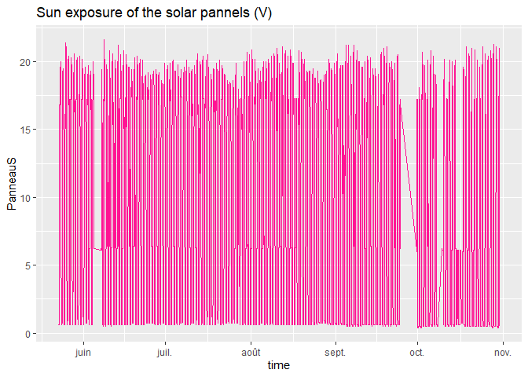
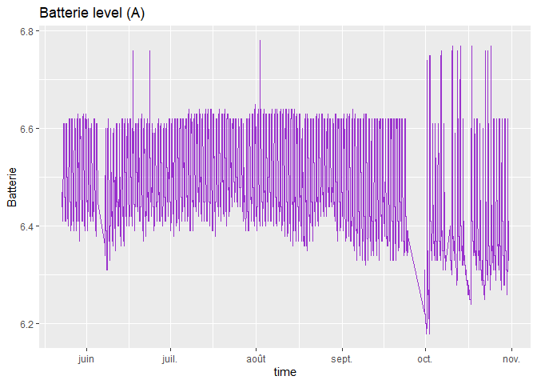

First_visualization
================
Alexandre Verept
14/10/2019

# Visualizing datas from opendata with R

## Importing datas

``` r
data=read.csv("https://opendata.lillemetropole.fr/explore/dataset/indice-qualite-de-lair/download/?format=csv&timezone=Europe/Berlin&use_labels_for_header=true", head=TRUE, sep=";")
```

## General view

``` r
head(data)
```

    ##        Geo.Point                                           Geo.Shape
    ## 1 50.6309,3.0468 {"type": "Point", "coordinates": [3.0468, 50.6309]}
    ## 2 50.6309,3.0468 {"type": "Point", "coordinates": [3.0468, 50.6309]}
    ## 3 50.6309,3.0468 {"type": "Point", "coordinates": [3.0468, 50.6309]}
    ## 4 50.6309,3.0468 {"type": "Point", "coordinates": [3.0468, 50.6309]}
    ## 5 50.6309,3.0468 {"type": "Point", "coordinates": [3.0468, 50.6309]}
    ## 6 50.6309,3.0468 {"type": "Point", "coordinates": [3.0468, 50.6309]}
    ##      qualif type_zone ObjectId y_wgs84 val_so2 couleur val_no2 val_o3
    ## 1       Bon   commune     1009 50.6309       0 #99E600       2      3
    ## 2       Bon   commune     1109 50.6309       0 #99E600       3      3
    ## 3       Bon   commune     1202 50.6309       0 #99E600       2      3
    ## 4 Médiocre   commune     1343 50.6309       0 #FFAA00       2      3
    ## 5       Bon   commune     1373 50.6309       0 #99E600       2      4
    ## 6     Moyen   commune     1391 50.6309       0 #FFFF00       3      5
    ##                    date_ech    id   source valeur val_pm25 code_zone
    ## 1 2018-03-19T01:00:00+01:00 26935 Atmo HDF      4        0     59350
    ## 2 2018-03-27T02:00:00+02:00 26943 Atmo HDF      4        0     59350
    ## 3 2018-04-03T02:00:00+02:00 26950 Atmo HDF      3        0     59350
    ## 4 2018-04-14T02:00:00+02:00 26961 Atmo HDF      6        0     59350
    ## 5 2018-04-16T02:00:00+02:00 26963 Atmo HDF      4        0     59350
    ## 6 2018-04-18T02:00:00+02:00 26965 Atmo HDF      5        0     59350
    ##   lib_zone x_wgs84                                           the_geom
    ## 1    Lille  3.0468 01010000206A08000000000000AA76254100000040DFED5A41
    ## 2    Lille  3.0468 01010000206A08000000000000AA76254100000040DFED5A41
    ## 3    Lille  3.0468 01010000206A08000000000000AA76254100000040DFED5A41
    ## 4    Lille  3.0468 01010000206A08000000000000AA76254100000040DFED5A41
    ## 5    Lille  3.0468 01010000206A08000000000000AA76254100000040DFED5A41
    ## 6    Lille  3.0468 01010000206A08000000000000AA76254100000040DFED5A41
    ##   val_pm10
    ## 1        4
    ## 2        4
    ## 3        2
    ## 4        6
    ## 5        3
    ## 6        5

``` r
summary(data)
```

    ##           Geo.Point  
    ##  50.6309,3.0468:668  
    ##                      
    ##                      
    ##                      
    ##                      
    ##                      
    ##                      
    ##                                                Geo.Shape  
    ##  {"type": "Point", "coordinates": [3.0468, 50.6309]}:668  
    ##                                                           
    ##                                                           
    ##                                                           
    ##                                                           
    ##                                                           
    ##                                                           
    ##            qualif      type_zone      ObjectId       y_wgs84     
    ##  Bon          :436   commune:668   Min.   :  11   Min.   :50.63  
    ##  Médiocre    : 93                 1st Qu.:2174   1st Qu.:50.63  
    ##  Mauvais      : 17                 Median :4333   Median :50.63  
    ##  Moyen        :101                 Mean   :4335   Mean   :50.63  
    ##  Très bon    : 20                 3rd Qu.:6499   3rd Qu.:50.63  
    ##  Très mauvais:  1                 Max.   :8660   Max.   :50.63  
    ##                                                                  
    ##     val_so2     couleur       val_no2          val_o3     
    ##  Min.   :0   #00CCAA: 20   Min.   :0.000   Min.   :0.000  
    ##  1st Qu.:0   #800000:  1   1st Qu.:1.000   1st Qu.:2.000  
    ##  Median :0   #99E600:436   Median :2.000   Median :3.000  
    ##  Mean   :0   #FF0000: 17   Mean   :1.642   Mean   :2.867  
    ##  3rd Qu.:0   #FFAA00: 93   3rd Qu.:2.000   3rd Qu.:4.000  
    ##  Max.   :0   #FFFF00:101   Max.   :4.000   Max.   :8.000  
    ##                                                           
    ##                       date_ech         id             source   
    ##  2018-01-01T01:00:00+01:00:  1   Min.   :21929   Atmo HDF:668  
    ##  2018-01-02T01:00:00+01:00:  1   1st Qu.:22096                 
    ##  2018-01-03T01:00:00+01:00:  1   Median :24261                 
    ##  2018-01-04T01:00:00+01:00:  1   Mean   :24594                 
    ##  2018-01-05T01:00:00+01:00:  1   3rd Qu.:26991                 
    ##  2018-01-06T01:00:00+01:00:  1   Max.   :28580                 
    ##  (Other)                  :662                                 
    ##      valeur          val_pm25   code_zone      lib_zone      x_wgs84     
    ##  Min.   : 2.000   Min.   :0   Min.   :59350   Lille:668   Min.   :3.047  
    ##  1st Qu.: 3.000   1st Qu.:0   1st Qu.:59350               1st Qu.:3.047  
    ##  Median : 4.000   Median :0   Median :59350               Median :3.047  
    ##  Mean   : 4.156   Mean   :0   Mean   :59350               Mean   :3.047  
    ##  3rd Qu.: 5.000   3rd Qu.:0   3rd Qu.:59350               3rd Qu.:3.047  
    ##  Max.   :10.000   Max.   :0   Max.   :59350               Max.   :3.047  
    ##                                                                          
    ##                                                the_geom      val_pm10     
    ##  01010000206A08000000000000AA76254100000040DFED5A41:668   Min.   : 0.000  
    ##                                                           1st Qu.: 2.000  
    ##                                                           Median : 3.000  
    ##                                                           Mean   : 3.196  
    ##                                                           3rd Qu.: 4.000  
    ##                                                           Max.   :10.000  
    ## 

## Data cleaning

We don’t care about some of those informations such as Geo point, Geo
shape…

``` r
keeps = c("date_ech", "valeur")
data = data[keeps]
head(data)
```

    ##                    date_ech valeur
    ## 1 2018-03-19T01:00:00+01:00      4
    ## 2 2018-03-27T02:00:00+02:00      4
    ## 3 2018-04-03T02:00:00+02:00      3
    ## 4 2018-04-14T02:00:00+02:00      6
    ## 5 2018-04-16T02:00:00+02:00      4
    ## 6 2018-04-18T02:00:00+02:00      5

Now we only have the data we want, so we will visualize it to have a
better understanding (even if it’s very basics datas)

``` r
library(ggplot2)
qplot(data$valeur,
      geom="histogram",
      breaks=seq(1, 10, by = 1),
      binwidth = 1,
      fill=I("orange"), 
      col=I("red"),
      main = "Histogram of IQ values", 
      xlab = "Index",
      xlim=c(1,10))
```

<!-- -->

We convert our weird date into a year/month/day

``` r
data$date_ech <- as.Date(data$date_ech, "%Y-%m-%d")
head(data)
```

    ##     date_ech valeur
    ## 1 2018-03-19      4
    ## 2 2018-03-27      4
    ## 3 2018-04-03      3
    ## 4 2018-04-14      6
    ## 5 2018-04-16      4
    ## 6 2018-04-18      5

We will now see the IQ values by date

``` r
ggplot(data = data, aes(x = date_ech, y = valeur))+
  geom_line(color = "orange", size = 0.5)
```

<!-- -->

# Data from censors on the roof

## Importing datas

We take a look at

``` r
data2=read.csv("RecuperationDonnees.csv", head=TRUE, sep=";")
head(data2)
```

    ##   id NumRuche TempBord TempInt HygroInt Poids TempExt HygroExt PanneauS
    ## 1  5        1     27.7    28.5       73  35.5    15.9       58      0.6
    ## 2  6        2     25.2    27.0       54  64.5    15.8       57      0.6
    ## 3  8        1     25.9    27.0       75  35.5    15.6       57      0.6
    ## 4  9        2     25.2    26.5       68  64.5    15.5       57      0.6
    ## 5 11        1     25.5    25.5       60  35.5    15.2       58      0.6
    ## 6 12        2     25.1    26.0       64  64.5    15.1       58      0.6
    ##   Batterie                time
    ## 1     6.46 2019-05-22 22:51:45
    ## 2     6.47 2019-05-22 23:01:55
    ## 3     6.46 2019-05-22 23:22:16
    ## 4     6.46 2019-05-22 23:32:26
    ## 5     6.46 2019-05-22 23:52:47
    ## 6     6.45 2019-05-23 00:02:56

As previously we will show select informations that could be
interesting.

``` r
keeps2 = c("TempExt", "HygroExt", "TempExt","PanneauS","Batterie","time")
data2 = data2[keeps2]
head(data2)
```

    ##   TempExt HygroExt TempExt.1 PanneauS Batterie                time
    ## 1    15.9       58      15.9      0.6     6.46 2019-05-22 22:51:45
    ## 2    15.8       57      15.8      0.6     6.47 2019-05-22 23:01:55
    ## 3    15.6       57      15.6      0.6     6.46 2019-05-22 23:22:16
    ## 4    15.5       57      15.5      0.6     6.46 2019-05-22 23:32:26
    ## 5    15.2       58      15.2      0.6     6.46 2019-05-22 23:52:47
    ## 6    15.1       58      15.1      0.6     6.45 2019-05-23 00:02:56

At first we convert the date and time:

``` r
data2$time <- as.POSIXct(data2$time)
head(data2$time)
```

    ## [1] "2019-05-22 22:51:45 CEST" "2019-05-22 23:01:55 CEST"
    ## [3] "2019-05-22 23:22:16 CEST" "2019-05-22 23:32:26 CEST"
    ## [5] "2019-05-22 23:52:47 CEST" "2019-05-23 00:02:56 CEST"

Some interesting graphs:

``` r
ggplot(data = data2, aes(x = time, y = TempExt))+
  geom_line(color = "blue", size = 0.5)+ ggtitle("Temperature (degree celsius)")
```

<!-- -->

``` r
ggplot(data = data2, aes(x = time, y = HygroExt))+
  geom_line(color = "chartreuse3", size = 0.5)+ ggtitle("Humidity (%)")
```

<!-- -->

``` r
ggplot(data = data2, aes(x = time, y = PanneauS))+
  geom_line(color = "deeppink", size = 0.5)+ ggtitle("Sun exposure of the solar pannels (V)")
```

<!-- -->

(Not very releavant)

``` r
ggplot(data = data2, aes(x = time, y = Batterie))+
  geom_line(color = "darkorchid3", size = 0.5)+ ggtitle("Batterie level (A)")
```

<!-- -->

(maybe releavant for the sun exposure)
