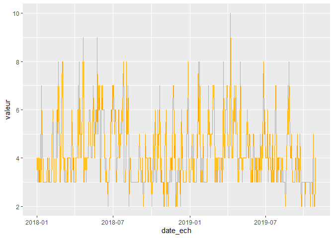
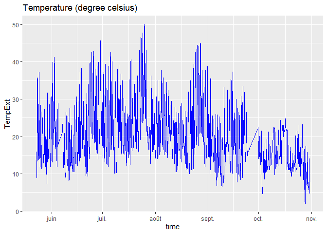
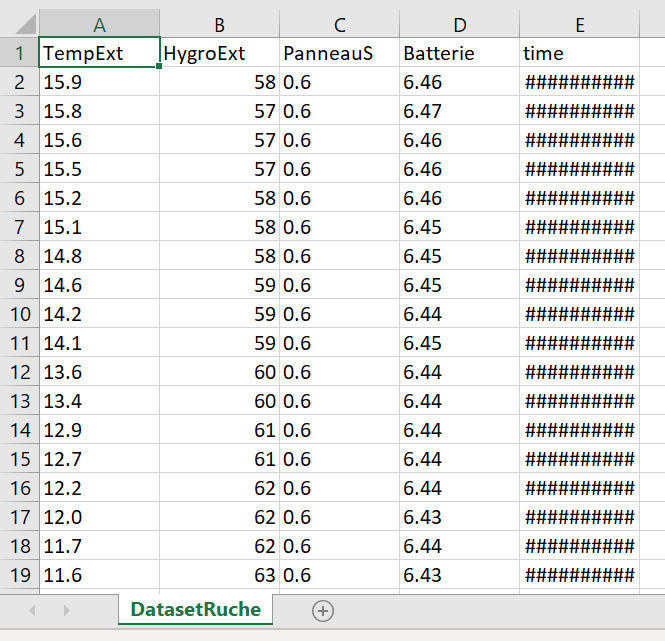

# AirIQ Project

## Introduction

This is a 2nd year student research project done by Mohamed Boulanouar, Maxime Thoor and Alexandre Verept, supervised by Kévin Hérissé (PhD student).

The goal is to create a predictiv model of the air index quality in the city of Lille, based on sensor placed on the roof of the school and datas found on the MEL opendata website.

We mainly use the Python language in order to collect datas from the APIs, treat them and apply a predictiv model with keras and Tensorflow.

For all the plannings and organisation, we used Trello with a TeamGantt powerup:

https://trello.com/b/2u0xyfoi/gestion-projet-airiq

Please take note that some codes/ressources are in French in this project

## This repository

- In "First_visualisation" you can see some of our preliminary observations with R, such as the evolution air quality index in Lille, or the temperature measured on the roof of the school:

- In "ExtractingDatas" are all our scripts to get our CSV files online or from an API, and then shape them as we want

  

- In "TrainingDataSet" are our attempts to train an AI on those datas.

