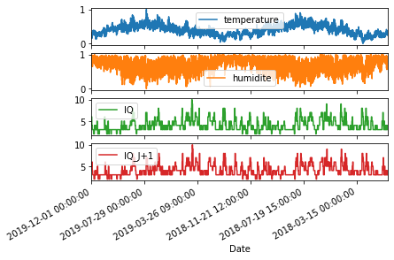
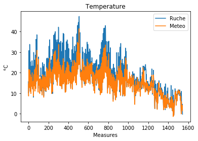
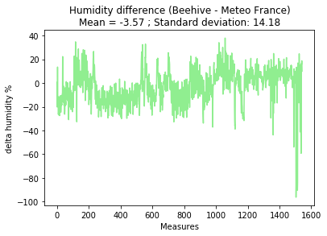

# AirIQ Project

This is a first year of master research project done by **Mohamed Boulanouar**, **Maxime Thoor** and **Alexandre Verept**, supervised by **Kévin Hérissé** (PhD student) at [**ISEN**](https://www.isen-lille.fr/) engineering school.

## Introduction

- The goal is to **create a predictive model of the air index quality in the city of Lille**, based on sensor placed on a beehive on the roof of the school, in order to **predict this index on a small scale.** Indeed, it's already possible to find precise predictions everywhere bases on complex model and simulations.

  You can fin an example of those predictions [here](http://airindex.eea.europa.eu/).

  By the way, the air quality is an index published everyday in the range 1 to 10, with 1 being the purest air possible, and 10 a dangerous level of pollution. 

- We mainly used the **Python** language in order to collect data from the APIs, treat them and apply a predictive model with **Keras** and **Tensorflow**. We also used **R** to visualize the data at the beginning of the project and create a demo online, and we had to recreate and use a **MySQL** database.

- For all the planning and organization, we used a Trello ([**here**](https://trello.com/b/2u0xyfoi/gestion-projet-airiq)) with a TeamGantt powerup (which is not public)

  

- *Please take note that some codes/resources are in French in this project, as the final evaluation is to realize a video explaining the process of a research project in an engineering school, and show it to French high school students.* 

## The process of this project

### Discovering the data

In *"0_First_visualization"* you can see some of our preliminary observations with R, such as the evolution air quality index in Lille, or the temperature measured on the roof of the school. 

We have created a dynamic display of those data online, in a way you can see them and interact [**here**](https://alexandre-verept.shinyapps.io/AirIQ_Showcase/)

We had to shape and clean available datasets, so we created some script that we could use again later.

### Creating our first neural network

All the scripts of this part can be found in the *"1_FirstLSTM"* folder.

- At this moment was the time to create the program that will predict the air index quality. None of us had a huge experience in this field, so we made our researches, and quickly found out that **we needed to use an RNN** (Recurrent Neural Network), as this kind of models allow us to **keep the temporality of the data** (so it keep the measures in chronological order and find links between different point in time).

  It is an important point, as the order of our measures is probably as useful as their values.

  More precisely, we choose to use an **LSTM** (Long Short Term Memory) since it looked like the more appropriate model for our needs. Indeed, this model choose which information to keep and prioritize from the previous neuron, and it is looking for temporal relations.

  

  If you want more technical information about RNNs and LSTMs, you can read [this article](http://colah.github.io/posts/2015-08-Understanding-LSTMs/) that we found very enlightening.

- So we managed to create our model and the according input data, we trained it on all the features we had, and we got those results **on the training data**:

  

  It didn't looked that bad, but the maximum **accuracy we had on validation data was around 35%**, which is not very satisfactory.

- We **raised some conclusions from this experience**, including (but not limited to):
  - We trained our model on spring/summer months, and validated on autumn months, so we need to shuffle our data before the training.
  - **Normalized data** produces more precise results.
  - The feature *"Panneaus"* (= solar panel) seams effectively useless as the accuracy did not moved significantly with or without it.
  - On this period of time, we do not have IQ to 10, 9, 8 and 1, so it lack some example of possible situations.
  - But most importantly, **131 days of data** (100 for training and 30 for validation) **is** **far from enough** as we expected ! Indeed the measures at ISEN (our school) only started in May, so we had less than a year of measures. We needed to **find more data** to train it !

### Improving our prediction with open data

All the scripts of this part can be found in the *"2_SecondLSTM"* folder.

- After those bad but encouraging results, we decided to **train our model on public data**, freely available online. We choose the weather dataset on the [Meteo France](https://donneespubliques.meteofrance.fr/?fond=produit&id_produit=90&id_rubrique=32) website. 

- After **downloading** every month of data since 1996, **selecting information** we needed and **cleaning** the measurements, we crossed this dataset with the one containing the IQ of everyday since 2018, and we **resampled** to have a measure every 3 hours on the last 2 years:

  

- Now was the time to **improve our LSTM**, and test it. Here are some results of the training of the *Meteo France* data:

  

  

  Considering we only use the temperature, humidity, and IQ of the previous day, ~70% of accuracy and ~0.5 of mean error was actually really satisfactory.

### Apply our new model to the beehive measures

All the scripts of this part can be found in the *"3_TrainingFinalLSTM"* folder.

- Now we **test the model we trained on open data to predict the IQ measures from the beehive**. This is the first result we had:

  

  - We drop from ~70% to ~50% of accuracy. 

- We wanted to understand the **difference between our training data and production data**, so we made tests and measures, including those ones:

  

  - We can clearly see that for the same day, the temperature measured by the censor from the beehive tends to be higher of 2,2°C in mean. Maybe we can add an offset to our training data.

  

  - For humidity, apart from aberrant values on the right side, there is no real offset to be added in the training data.

### Create the final product

All the scripts of this part can be found in the *"4_Production"* folder.

- Coming soon